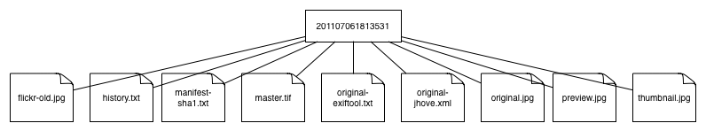

isaw.images
===========

By Tom Elliott (tom.elliott@nyu.edu)

Copyright 2014, 2015 New York University.

For rights and licensing, see LICENSE.txt file.

This package is intended to house various routines for managing ISAW's imagery collections. 


Installation, Requirements, and Dependencies
---------------------------------------------

This Python package has been tested under Python 2.7.8 running on Mac OSX 10.9.5 and on Ubuntu Linux 14.04.2 LTS; however, the ```migrate.sh``` script expects a modern version of bash and associated utilities and therefore only runs successfully on Linux.

**Note** that some of the Python requirements discussed below have their own dependencies on non-Python packages. So, you will need to ensure at least the following **before running pip**:

 * Install libraries needed by the Pillow package to support TIFF and JPEG image formats and color management (i.e., libtiff, libjpeg, and littlecms): visit the [Pillow Installation page](https://pillow.readthedocs.org/installation.html) and scroll down to the appropriate section for your platform (Mac or Ubuntu) for instructions on how to install these libraries. Failure to install libtiff, libjpeg, and littlecms first will cause pip to fail to install requirements. You do not need to install Pillow separately from the ```pip install``` step below.

 * Install the [ExifTool](http://www.sno.phy.queensu.ca/~phil/exiftool/	) utility, which is wrapped by the pyexiftool package included via requirements.txt. Failure to install ExifTool first will cause pip to fail to install requirements. You do not need to install pyexiftool separately from the ```pip install``` step below.

Use of a [Python virtual environment](http://docs.python-guide.org/en/latest/dev/virtualenvs/) pinned to 2.7.8, with [pip](https://pip.pypa.io/en/latest/) installed in order to manage package installations, is highly recommended. Python dependencies are detailed in ```requirements.txt```, so that they can be installed easily into the virtual environment (after activation thereof) using this simple command:

```
pip install -r requirements.txt
```

Once everything is succesfully installed, try running the built-in code tests to make sure everything is operating right. This package uses the [nose](https://nose.readthedocs.org/en/latest/) Python unit test environment. It will have been installed along with the other requirements by pip. At the command line, enter the top-level directory of isaw.images package, activate the associated virtual environment, and type:

```
nosetests
```


If you get any errors, double-check installation steps above and, if you can't find the problem, contact the isaw.images package developer.


Filesystem Structure
---------------------

We start with a filesystem structure for managing each notional image as an "isaw image package" (IIP): a directory that contains multiple files related to a single notional image. This IIP directory has the following components:

 * manifest-sha1.txt = a text file containing filenames and corresponding sha1 hashes for each file in the IIP. Format must conform to that specified for the [BagIt](https://github.com/jkunze/bagitspec) manifest.

 * original.[EXT] = the unchanged original image file, in whatever its original format, the only changes being: normalizing the filename to the string "original" and lower-casing the extension

 * original-exif.json = a dump of all the EXIF data found in the original image at time of import (if any), extracted with EXIFTool and dumped to disk in its default JSON output serialization.

 * master.tif = a TIFF file created from original.[EXT] at time of import. The main purpose of this file is to provide a color-managed, digital-preservation-friendly version of the image, captured as early as possible in the lifecycle. The only changes made to the image in converting from original to TIFF are the format itself, the standardization of header content, and the conversion from the original color profile (if any) to the [sRGB v4 Preference Profile](http://www.color.org/srgbprofiles.xalter#v4pref).

 * preview.jpg = a JPEG file derived from master.tif at time of import, maximum length of long axis: 800 pixels at 72dpi. The main purpose of this file is to provide a ready image of legible but minimal size to facilitate rapid preview in application and reuse contexts. 

 * thumbnail.jpg = a JPEG file derived from master.tif at time of import, maximum length of long axis: 200 pixels at 72dpi. The main purpose of this file is to provide a ready image of standard dimensions suitable for use in browse contexts, search results, contact sheets, and the like.

 * metadata.xml = an XML file, conforming to the [ISAW Images Metadata Schema](./isaw/images/meta/meta-schema.rnc), that contains descriptive information about the image.

 * history.txt = a text file to which is appended a single-line notice about each major change to the IIP

 


Classes and Methods
--------------------

The Package class, defined in isaw/images/package.py, provides the brains for managing ISAW Image Packages on a local filesystem. It defines the following outward-facing methods:

 * create: create a new image package at the targeted path (implemented: see isaw/images/tests/test_package.py)

 * open: open an existing image package at the targeted path (stubbed, but not yet implemented)

 * delete: delete the current image package (stubbed, but not yet implemented): assumes Package.open() has already been called.

 * validate: verify completeness and fixity of the current package (stubbed, but not yet implemented): assumes Package.open() has already been called.


